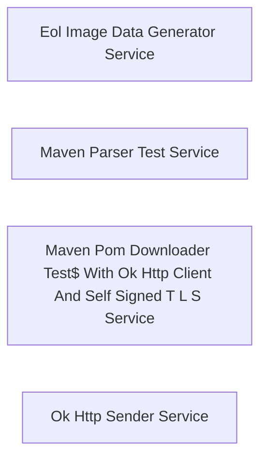

# Architecture

## System Diagram

## Components

### External Services

- **Eol Image Data Generator Service**: HTTPS service
- **Maven Parser Test Service**: HTTPS service
- **Maven Pom Downloader Test$ With Ok Http Client And Self Signed T L S Service**: HTTPS service
- **Ok Http Sender Service**: HTTPS service

## Reference

For the complete CALM (Common Architecture Language Model) schema, see [calm-architecture.json](calm-architecture.json).
