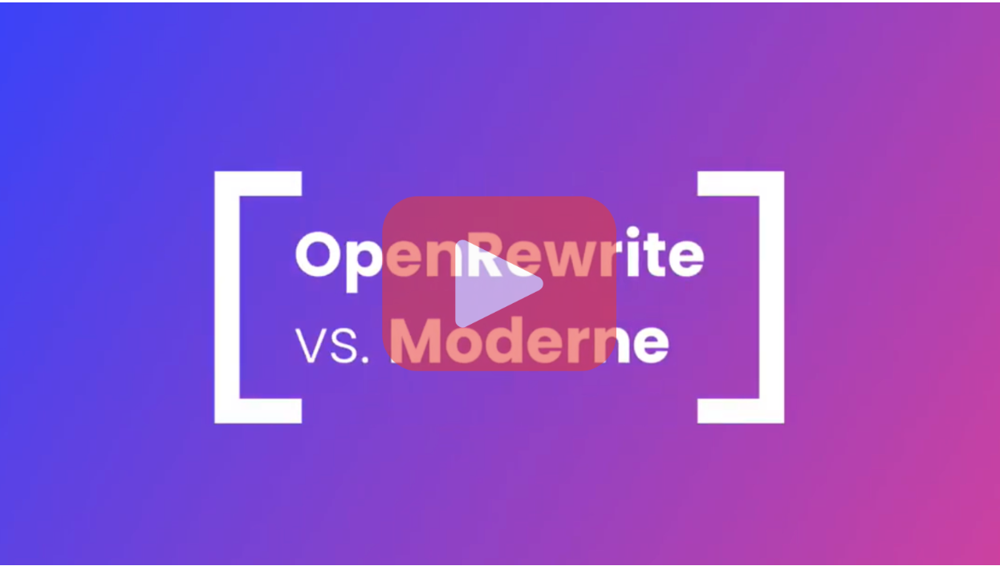

  

<!-- Keep the gap above this line, otherwise they won't render correctly! -->

<h1 align="center">Fast, repeatable refactoring for developers</h1>

The OpenRewrite project is an automated refactoring ecosystem for source code, enabling developers to effectively eliminate technical debt within their repositories.

It consists of an auto-refactoring engine that runs prepackaged, open source refactoring recipes for common framework migrations, security fixes, and stylistic consistency tasks—reducing your coding effort from hours or days to minutes. Build tool plugins like [OpenRewrite Gradle Plugin](https://docs.openrewrite.org/reference/gradle-plugin-configuration) and [OpenRewrite Maven Plugin](https://docs.openrewrite.org/reference/rewrite-maven-plugin) help you run these recipes on one repository at a time.

OpenRewrite recipes have bench strength in Java and are part of a growing community of languages, frameworks, and tech. It’s thousands of great individuals and teams working to make software seamless to update and continuously secure. You can also easily customize recipes for your code.

Start with our [quickstart guide](https://docs.openrewrite.org/running-recipes/getting-started) and let OpenRewrite handle the boring parts of software development for you.

Get and stay informed:
* Read the [documentation](http://docs.openrewrite.org).
* Join us on [Slack](https://join.slack.com/t/rewriteoss/shared_invite/zt-nj42n3ea-b~62rIHzb3Vo0E1APKCXEA) or [Discord](https://discord.gg/xk3ZKrhWAb)! We're happy to answer your questions directly.
* Check out [Community Office Hours](https://www.youtube.com/@moderne-auto-remediation/streams) where we deep dive topics and answer questions.
* Subscribe to our [YouTube](https://www.youtube.com/@moderne-auto-remediation) channel for great videos on OpenRewrite recipes.
* Follow us on [Twitter](https://twitter.com/openrewrite) and [LinkedIn](https://www.linkedin.com/company/moderneinc).

OpenRewrite is Apache2 licensed and maintained by Moderne. OpenRewrite's refactoring engine and recipes will always be open source.

## Refactoring at scale with Moderne

[Moderne](https://www.moderne.io/) is a commercial platform designed to run the OpenRewrite recipe catalog with incredible efficiency, supporting large codebases and multiple repositories. It’s a place where platform teams and developers can collaborate to drive migrations across their codebases, mass-commit code fixes, and perform large-scale impact analyses.

See how Moderne and OpenRewrite work in different ways to transform your code.

Moderne freely runs an [open public service](https://www.moderne.io/try-moderne) for the benefit of tens of thousands of open source projects. The platform can streamline your recipe customization and creation, enabling quick assembly and testing. It also includes a multi-repo command line interface (CLI) to enable developers to run and customize recipes locally.

To understand better how Moderne can help your team, [contact us](https://www.moderne.io/contact-us).

## Contributing

We appreciate all types of contributions. See the [contributing guide](https://github.com/openrewrite/.github/blob/main/CONTRIBUTING.md) for detailed instructions on how to get started.
