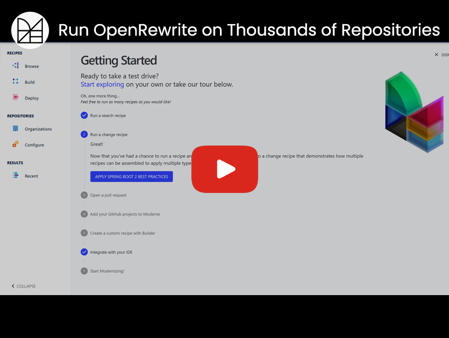

# Automate software refactoring.

## More tech. Less debt.

The OpenRewrite project is a mass source code refactoring ecosystem. Reduce 1000s of hours of static code analysis fixes to minutes. Turn a four month migration project into four hours of work. Patch security vulnerabilities across 100s of repositories at once. OpenRewrite automates code refactoring and remediation tasks for you, enabling developers to deliver more business.

Start with our [quickstart guide](https://docs.openrewrite.org/getting-started/getting-started) and let OpenRewrite start handling the boring parts of software development for you. Full documentation available at [docs.openrewrite.org](https://docs.openrewrite.org/).

Feel free to join us on [Slack](https://join.slack.com/t/rewriteoss/shared_invite/zt-nj42n3ea-b~62rIHzb3Vo0E1APKCXEA) or [Discord](https://discord.gg/xk3ZKrhWAb)! We're happy to answer your questions directly. Also, follow us on [Twitter](https://twitter.com/moderneinc) and [LinkedIn](https://www.linkedin.com/company/moderneinc).

See this [doc page](https://docs.openrewrite.org/reference/building-openrewrite-from-source) for more on building this repository from source.
  
## Refactoring at scale with Moderne

OpenRewrite's refactoring engine and recipes will always be open source. Build tool plugins like [OpenRewrite Gradle Plugin](https://docs.openrewrite.org/reference/gradle-plugin-configuration) and [OpenRewrite Maven Plugin](https://docs.openrewrite.org/reference/rewrite-maven-plugin) help you run these recipes on one repository at a time. Moderne is a complementary product that executes OpenRewrite recipes at scale on hundreds of millions of lines of code and enables mass committing of results. Moderne freely runs a [public service](https://public.moderne.io) for the benefit of thousands of open source projects.

