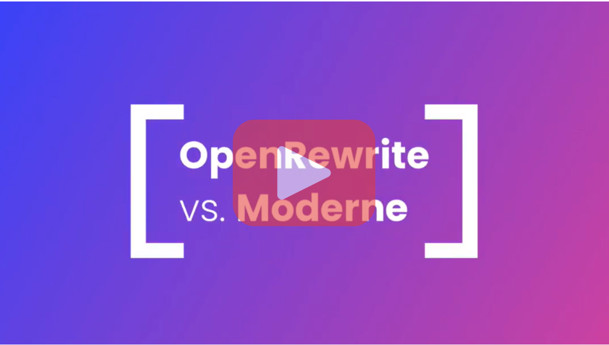
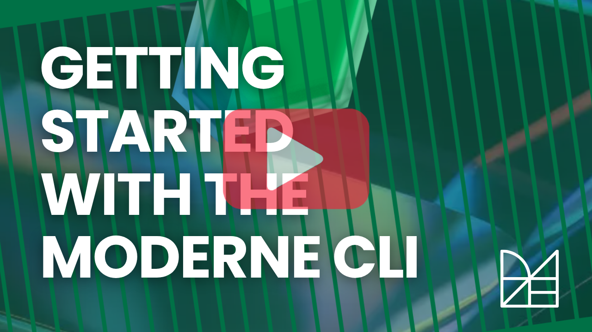

  <a href="https://docs.openrewrite.org">
    <picture>
      <source media="(prefers-color-scheme: dark)" srcset="https://github.com/openrewrite/rewrite/raw/main/doc/logo-oss-dark.svg">
      <source media="(prefers-color-scheme: light)" srcset="https://github.com/openrewrite/rewrite/raw/main/doc/logo-oss-light.svg">
      
    </picture>
  </a>

<!-- Keep the gap above this line, otherwise they won't render correctly! -->

<h1 align="center">Fast, repeatable refactoring for developers</h1>

The OpenRewrite project (managed by [Moderne](https://www.moderne.ai/)) is an open-source automated refactoring ecosystem for source code, enabling developers to effectively eliminate technical debt within their repositories.

It consists of an auto-refactoring engine that runs prepackaged, open source refactoring recipes for common framework migrations, security fixes, and stylistic consistency tasks—reducing your coding effort from hours or days to minutes.

OpenRewrite provides open-source parsers and base recipes for [multiple languages](https://docs.openrewrite.org/reference/supported-languages), including Java, Kotlin, Groovy, JavaScript/TypeScript, Python, and C#. For Java, the [OpenRewrite Gradle Plugin](https://docs.openrewrite.org/reference/gradle-plugin-configuration) and [OpenRewrite Maven Plugin](https://docs.openrewrite.org/reference/rewrite-maven-plugin) let you run one recipe at a time against a single repository. Recipes are easy to customize, so you can adapt any of them - or even write your own.

Start with our [quickstart guide](https://docs.openrewrite.org/running-recipes/getting-started) and let OpenRewrite handle the boring parts of software development for you.

Get and stay informed:
* Read the [documentation](http://docs.openrewrite.org).
* Join us on [Slack](https://join.slack.com/t/rewriteoss/shared_invite/zt-nj42n3ea-b~62rIHzb3Vo0E1APKCXEA) or [Discord](https://discord.gg/xk3ZKrhWAb)! We're happy to answer your questions directly.
* Check out [Code Remix Weekly](https://www.youtube.com/@moderne-and-openrewrite/streams) where we deep dive topics and answer questions.
* Subscribe to our [YouTube](https://www.youtube.com/@moderne-and-openrewrite) channel for great videos on OpenRewrite recipes.
* Follow us on [X](https://x.com/openrewrite) and [LinkedIn](https://www.linkedin.com/company/moderneinc).

OpenRewrite is maintained by Moderne. The core framework is Apache2 licensed and will always be open source, as are many recipes in the catalog. See [Licensing](https://docs.openrewrite.org/licensing/openrewrite-licensing) for how the framework and recipes are licensed.

## Building on OpenRewrite with Moderne
 
OpenRewrite is built to migrate, secure, and refactor code one repository at a time. [Moderne](https://www.moderne.ai/) is the commercial platform built on that foundation, running the same recipes across hundreds or thousands of repositories at once. Migrations are a common starting point with OpenRewrite, and the platform expands on this to include large-scale impact analysis, security remediation, and the tools coding agents use to understand and change code across a whole organization. Moderne also extends OpenRewrite from Java to additional languages and from individual developers to teams and coding agents. While the parsers and base recipes for those additional languages are open source, running recipes against them requires a Moderne license. 
 
A lot of this comes down to how the [Lossless Semantic Tree (LST)](https://docs.openrewrite.org/concepts-and-explanations/lossless-semantic-trees) is handled. The LST is OpenRewrite's type-aware model of your source code, built in memory each time a recipe runs. Moderne batch-builds LSTs once and serializes them, so they can be reused across repos and across teams without rebuilding. That same LST gives coding agents pre-computed context, type-aware search, and direct access to OpenRewrite recipes as deterministic tool calls through tools like [Prethink](https://docs.moderne.io/user-documentation/agent-tools/prethink), [Trigrep](https://docs.moderne.io/user-documentation/agent-tools/trigrep), and a [local MCP server](https://docs.moderne.io/user-documentation/agent-tools/mcp). Agents work with less token overhead and more accuracy than they would reading a codebase file by file.
 
See how Moderne and OpenRewrite work in different ways to transform your code:

Moderne also includes a [multi-repo command line interface (CLI)](https://docs.moderne.io/user-documentation/moderne-cli/getting-started/cli-intro) for building LSTs, running recipes locally, and developing custom recipes across many repositories.

Moderne runs a free [public service](https://www.moderne.io/try-moderne) for the benefit of tens of thousands of open source projects. To learn more about how Moderne can help your team, [contact us](https://www.moderne.io/contact-us).

## Contributing

We appreciate all types of contributions. See the [contributing guide](https://github.com/openrewrite/.github/blob/main/CONTRIBUTING.md) for detailed instructions on how to get started.
