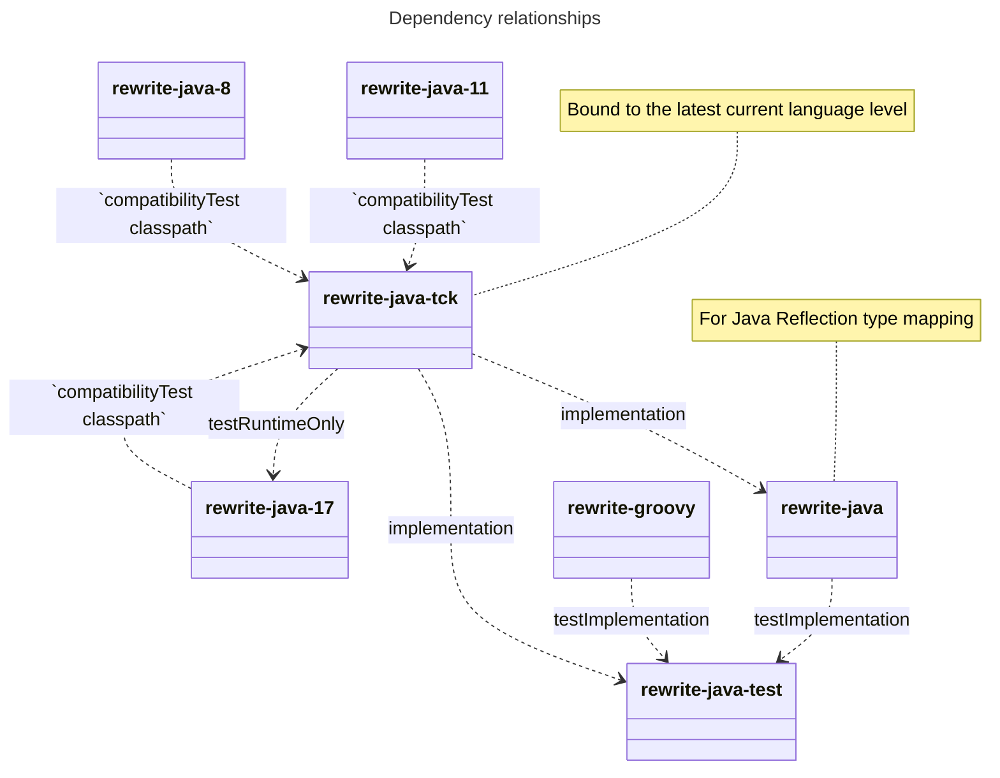

## Rewrite Java Technology Compatibility Kit

This project contains the source code for the Rewrite Java Technology Compatibility Kit (TCK). The TCK is a set of tests that can be used to verify that a `JavaParser` implementation conforms to expectations.

### Dependency relationships with `rewrite-java-tck`

Dependency relationships between parser implementations and the TCK:

